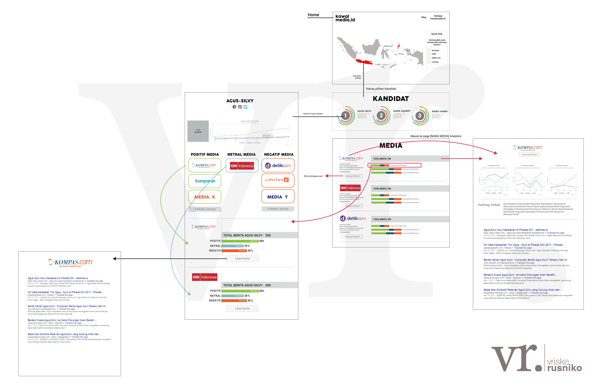

# Rojak-Web-Frontend

Rojak Web Frontend is the users's GUI for [kawalmedia.id](http://kawalmedia.id) (Coming Soon)
built on top of React JS. This repository is also submodule repository of
[Rojak](https://github.com/imrenagi/rojak). Feel free to check the parent repository
if you are interested to contribute in other [kawalmedia.id](http://kawalmedia.id)  components.

## Rojak

Rojak is a **non-profit** and open source project used for observing online news
website in any election in Indonesia. It can be useful for doing some news data
analytics in presidential, governor, or even major election. This project actually was
initialized at the very first time at October 2016 [here](https://github.com/pyk/rojak),
to observe the 2017 governor election in DKI Jakarta. However, because there were some
unfinished tasks on our first initiative, we weren't able to release this project
to production. However, since the responses/contributions from the developer community was
extremely good at that time, we have been thinking about restarting this initiative
and coming up with new requirements for the incoming election in Indonesia.

### Why Rojak?

In the long journey of an public election, our citizen usually get informations about
the election candidate from the online news site. Unfortunately, some of the
online media tend to take a side in one of the election candidates. This can create
bias to some/most of the informations published on the site. It could give
positive impact for a candidate they take the side with, or even bad impact to
another candidate and vice versa. Unfortunately, it might give some impact to
all/most of the citizen's sentiment about one or more candidates.

By developing this project, we really have a huge hope that we can increase the
awareness of our citizens by providing them the analytical data about how news media
creates stories and takes a side in an election. Besides, by contributing to this
open source project, we hope that we will be able to stimulate more developers
in Indonesia to contribute to open source software community.

### kawalmedia.id?

Ultimately, we are going to call this project as **kawalmedia.id**. The usage of **Rojak**
as the name of this project is to preserve the original initiative of this project.

### Main Features

For the first major release, this project will provide the following functionalities:
* The sentiment analytics about **Pilkada Gubernur Jawa Barat** and/or **Pilkada
Gubernur Jawa Timur**.
* **Sentiment analytics** from all of the news created by some national or regional
news websites related to those elections

## Project Wireframe

Thanks to [@vriskerusniko](https://twitter.com/vriskerusniko) for creating this
wireframe:

## Getting started

* Install node, npm or yarn
* Install dependencies by running : `npm install` or `yarn install`
* Run application byL `npm start` or `yarn start`

## How To Contribute

* All tasks related to frontend are documented in github issue and/or
[Frontend Trello board](https://trello.com/b/6SVhUtTo).
* Contributions are not limited to the tasks in Trello board. If you capture one
 or more bugs, feel free to create issue and then submit Pull Request to solve that issue.
* If you are interested in contributing in features development, feel free to
take a task from Trello board and submit an issue in this repository.
By default, you will not have access to edit the Trello board because you haven't
been invited to Trello board. If that's the case, please create an issue and put
description about which task that you want to work on. We will add you to the team
member ASAP.
* Please go and check out [Contributing Code of Conduct](./CONTRIBUTING.md)
